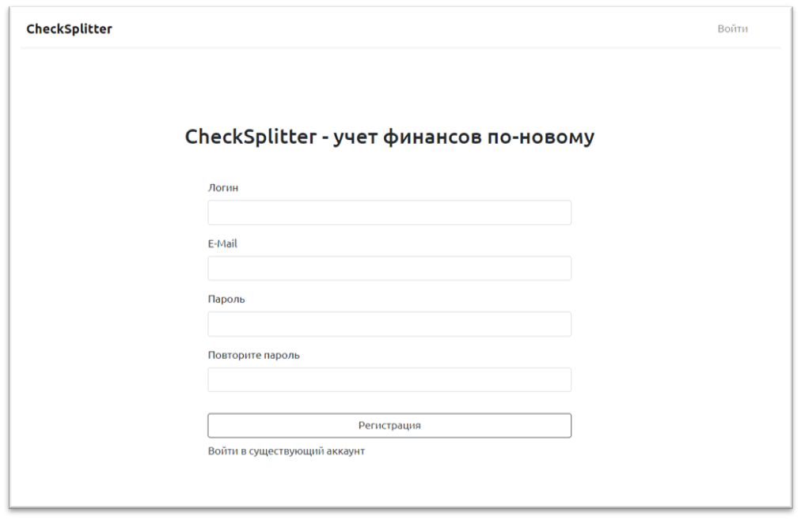
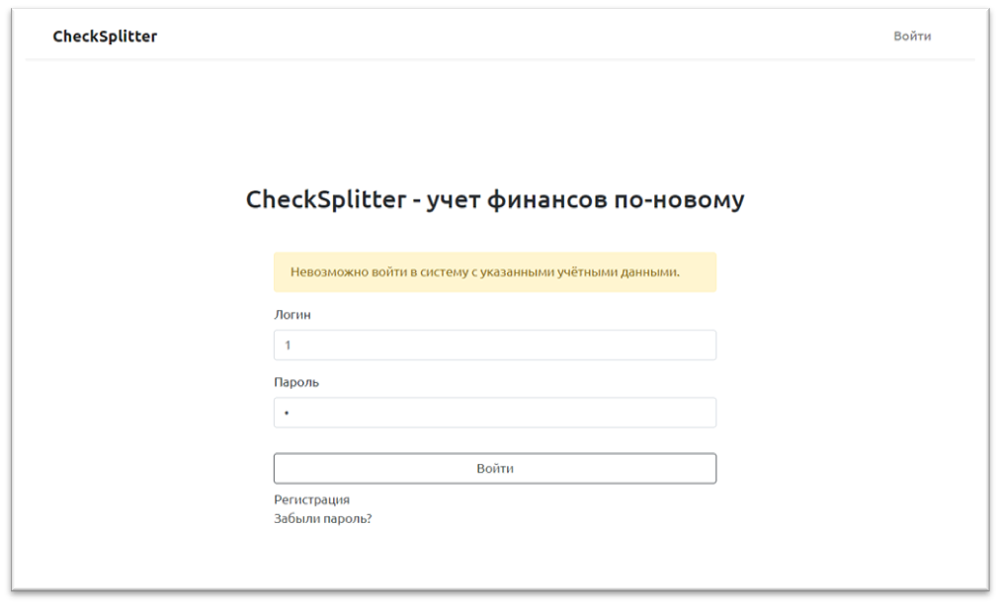
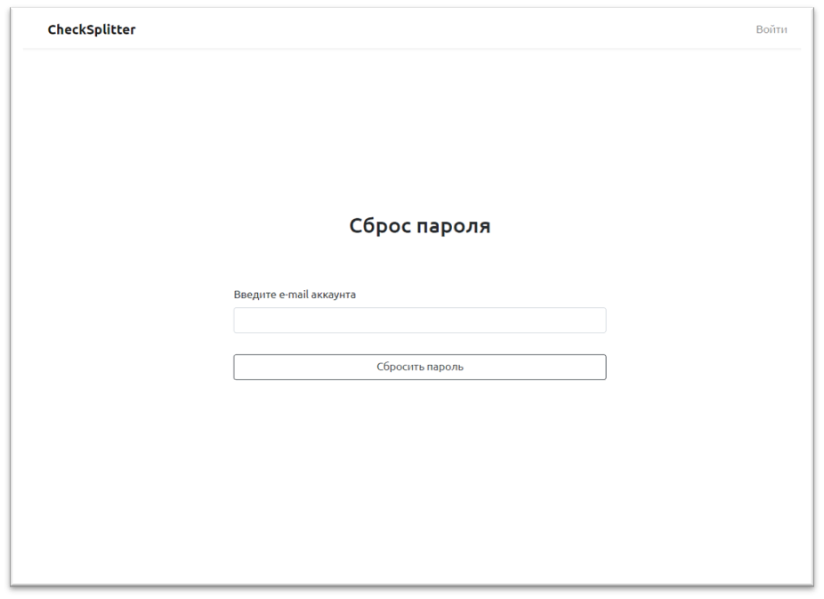
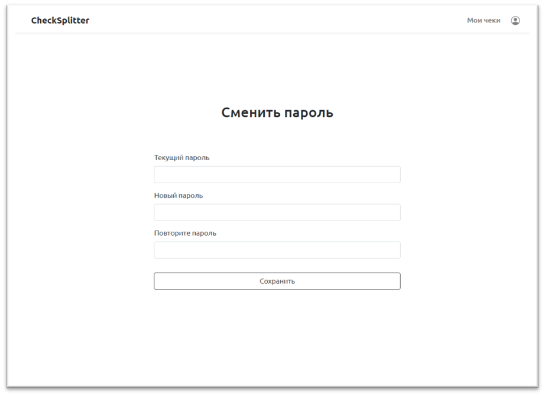

# Nuxt Auth
Возможности:

* авторизация различными методами
* сохранение авторизационных данных в store и localStorage
* интерсепторы для Axios
* редиректы после входа/выхода из системы
* хранение данных пользователя в store
* проверка доступа к страницам на уровне роутера

# Страницы модуля авторизации

## Регистрация

Возможности:

* регистрация
* отрисовка ошибок полей формы

## Авторизация

Возможности:

* авторизация
* отрисовка ошибок формы

## Сброс пароля

Возможности:

* сброс пароля по e-mail

## Изменение пароля

Возможности:

* изменение пароля с помощью текущего
