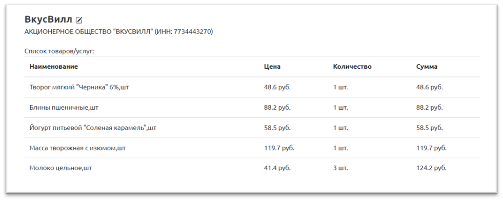

# Компоненты

## Компронент информации о чеке

Возможности:

* просмотр базовой информации о чеке, списка товаров

Используется:

* [страница просмотра моих чеков](receipts.md)
* [страница просмотра отдельного чека](receipts.md)
