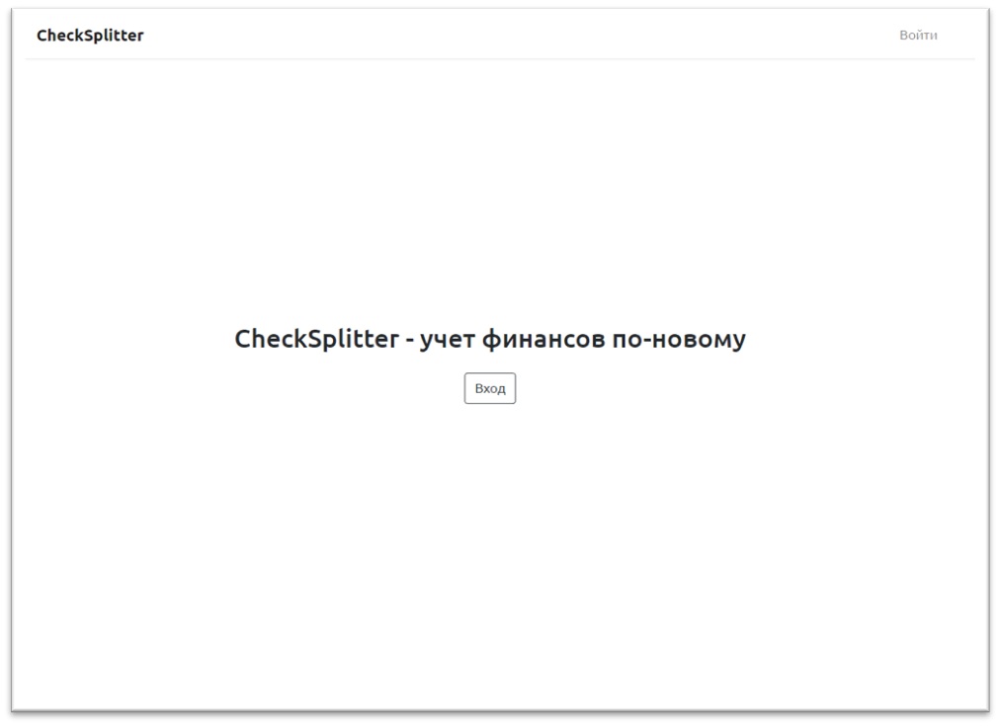

# Документация CheckSplitter

Реализованный функционал:

* [Главная страница](index.md)
* [Регистрация пользователя](auth.md)
* [Авторизация пользователя](auth.md)
* [Изменение пароля](auth.md)
* [Сброс пароля](auth.md)
* [Профиль (изменение информации о пользователе, обновление аватарки)](user.md)
* [Страница просмотра моих чеков](receipts.md)
* [Функционал синхронизации чеков](receipts.md)
* [Страница просмотра отдельного чека](receipts.md)
* [Функционал переименования чека](receipts.md)
