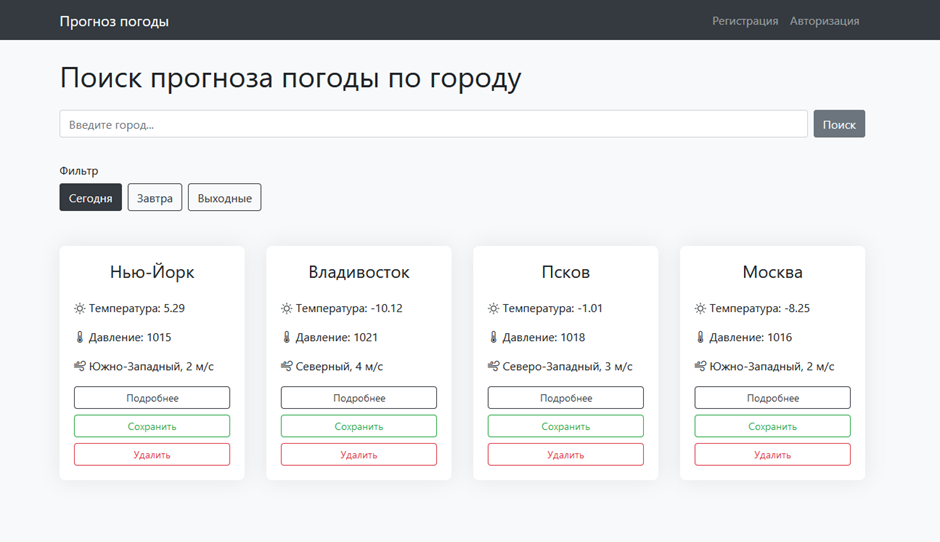

# Прогноз погоды

Сервис прогноза погоды – идеальный кейс для закрепления полученных знаний в 
рамках курса по фронтенд разработке. У подобных сервисов по получению данных о
погоде есть множество функционала: от получение простых данных (например, количество
градусов, как ощущается погода, количество осадков, скорость ветра, параметры
влажности и тд) до просмотра динамических карт с изменением температуры по минутам. 
Я считаю, что будущее стоит за персонализированными сервисами. К сожалению, 
сейчас на рынке множество решений, которые содержат большое количество рекламы и 
избыточный функционал. Поэтому целью в рамках это курсовой работы я поставила:
разработка клиентской части сервиса прогноза погоды средствами фреймворка
Vue.JS с минимально нужным функционалом и приятным дизайном.

