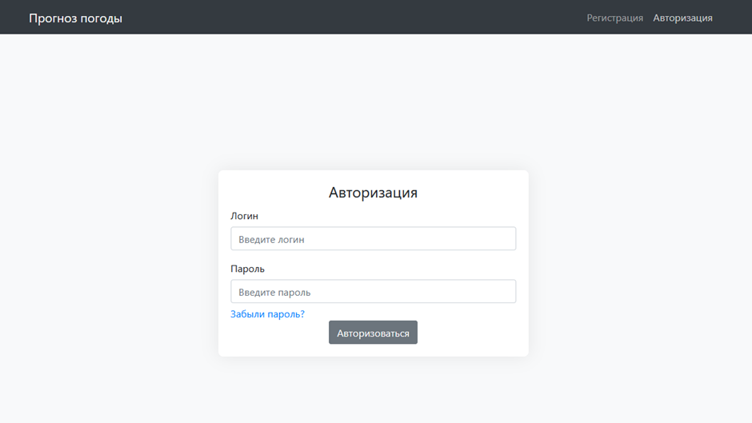
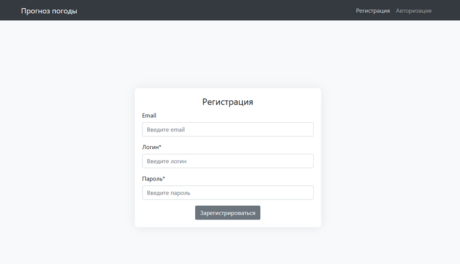
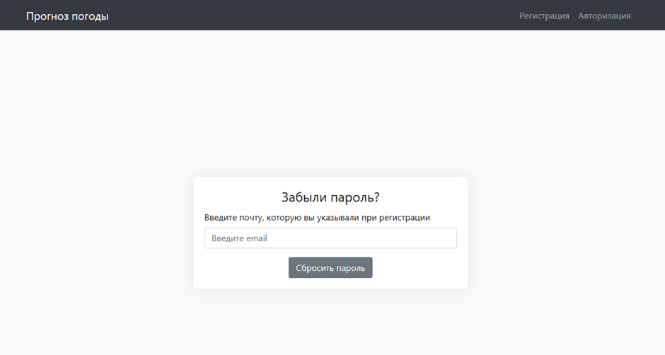
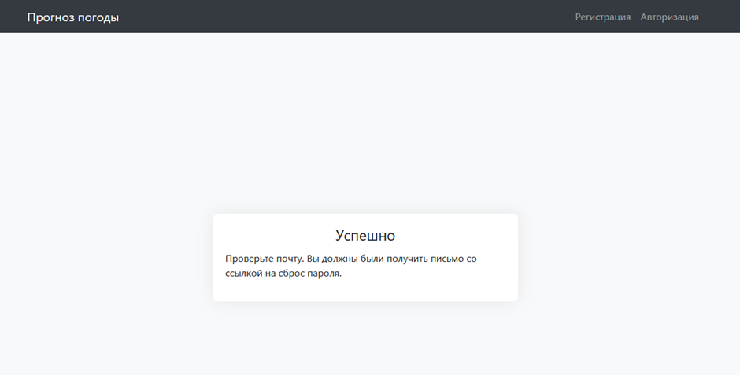
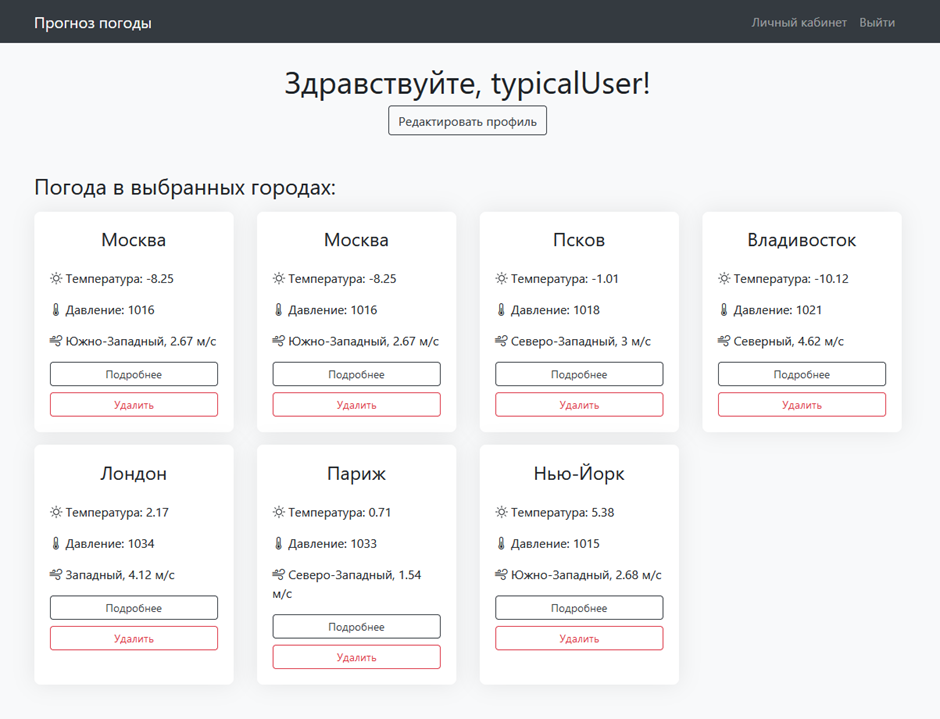
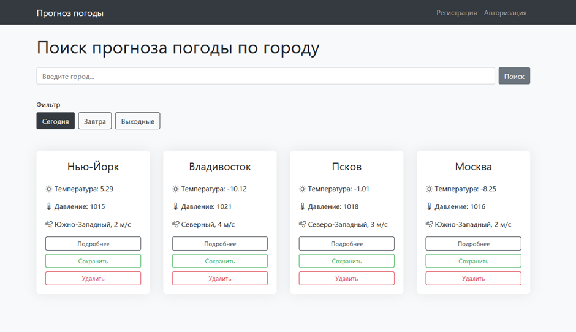
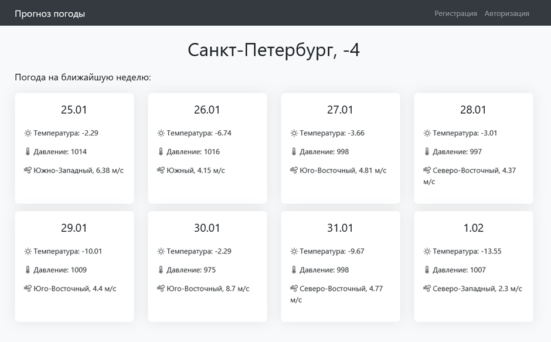
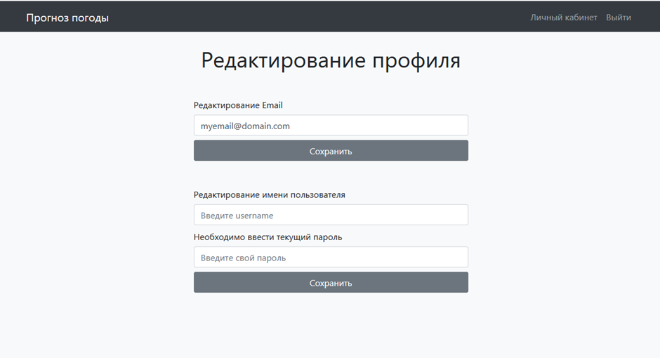

# Страницы сервиса

В финальной версии сервиса для получения прогноза погоды в разных городах реализовано 8 страниц:

1.	Авторизация
2.	Регистрация
3.	Сброс пароля
4.	Сообщение об успешном сбросе пароля
5.	Личный кабинет с добавленными городами
6.	Главная страница с поиском городов и фильтрацией по дате
7.	Информация о погоде в городе на ближайшую неделю
8.	Редактирование информации пользователя

## Авторизация

## Регистрация

## Сброс пароля

## Сообщение об успешном сбросе пароля

## Личный кабинет с добавленными городами

## Главная страница с поиском городов и фильтрацией по дате

## Информация о погоде в городе на ближайшую неделю

## Редактирование информации пользователя

