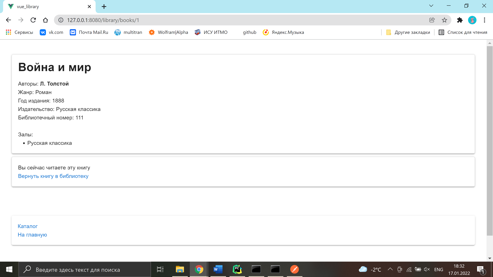
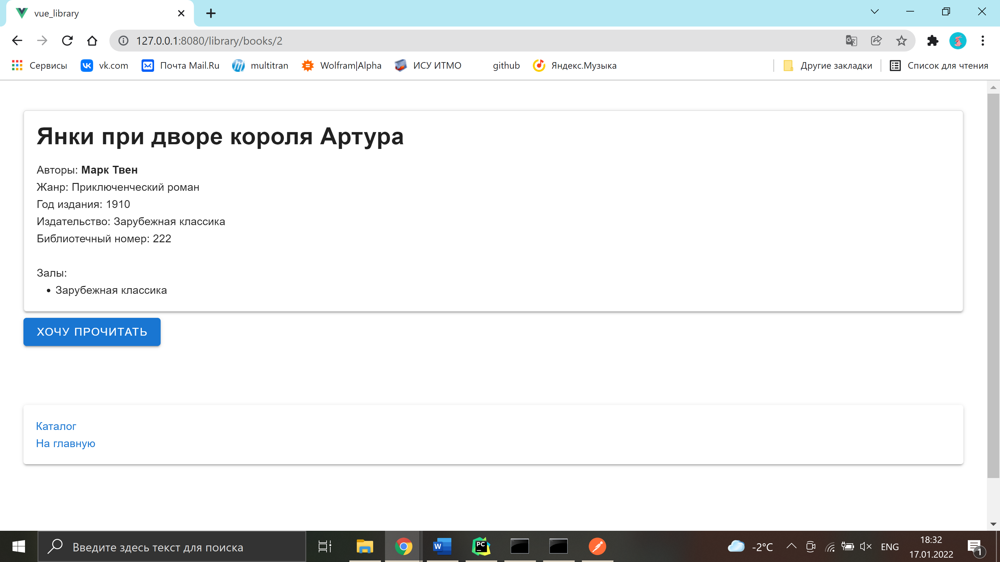

# Specific book info

**URL** : `/book/:id`

* A book the user is currently reading

* A book the user is not currently reading

### Description

The page displays the information about the book (title, authors, genre, etc.). If the user is currently reading this
book, this message is shown on the page next to the _return_ link. If the user is not reading this book
currently, they can press the _take out_ button to get the book from the library.  
At the bottom of the page there are links to the library catalogue and home pages.