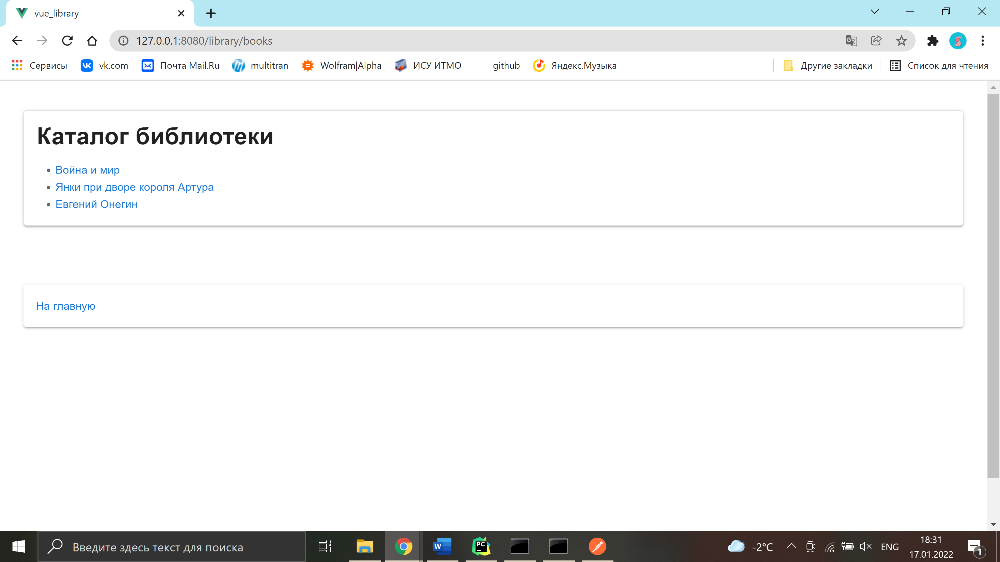

# Catalogue

**URL** : `/book/:id`

### Description

The page displays the list of the books available in the library. By clicking on a specific book, the user can go to a
corresponding book info page.  
At the bottom of the page there is a link to the home page.