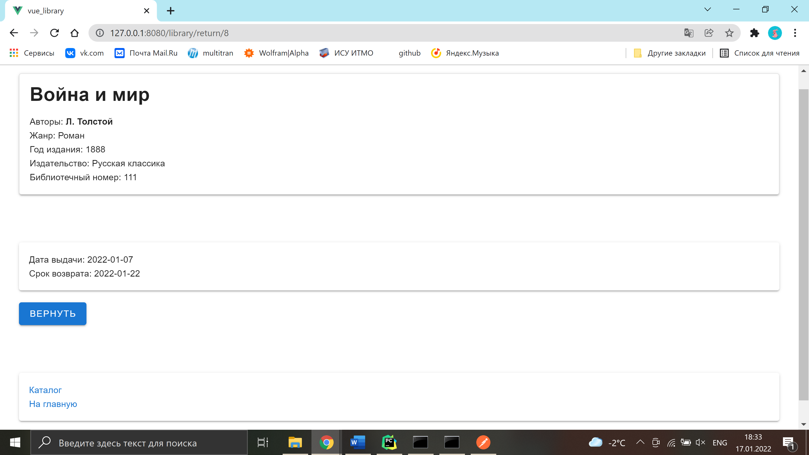

# Return a book

**URL** : `/return/:id`

### Description

The page displays the basic information about the book the user wants to return, the issue date and the due date. If the
user presses the _return_ button, the book gets back to the library, and the user is forwarded to the catalogue.  
At the
bottom of the page there is a link to the home page.