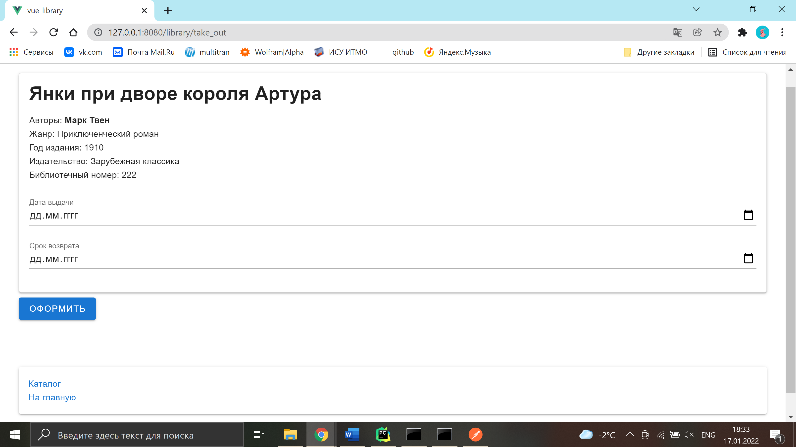

# Take out a book

**URL** : `/take_out/`

### Description

The page displays the basic information about the book the user wants to take out. The user is supposed to choose the _issue date_ (when the book was taken out) and _due date_ (when the book is due
back in the library). Then they should press the _finalize_ button.  
At the bottom of the page there is a link to the home page.