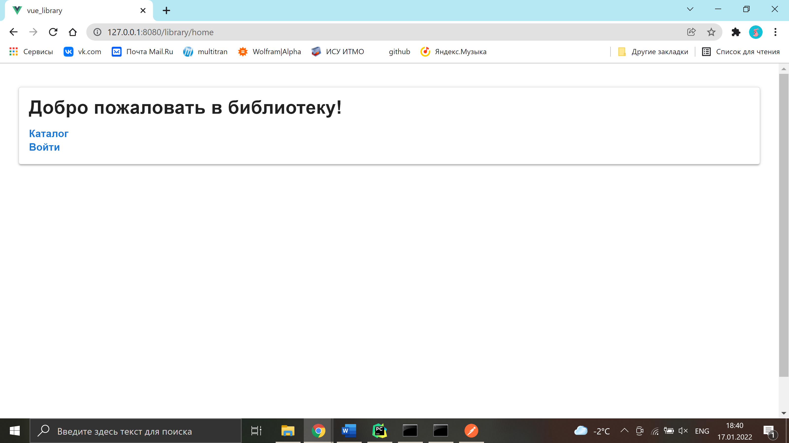
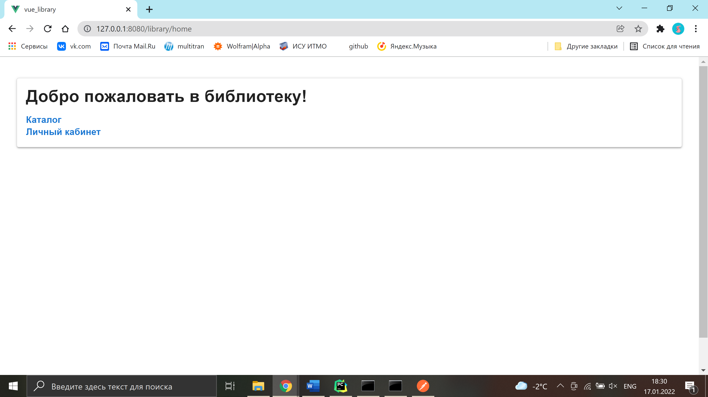

# Home

**URL** : `/home/`

* Unauthenticated user

* Authenticated user

### Description

The page displays a welcome message and contains links to the library catalogue and the reader profile. If the user is
not authenticated, the page shows a sign-in link.

