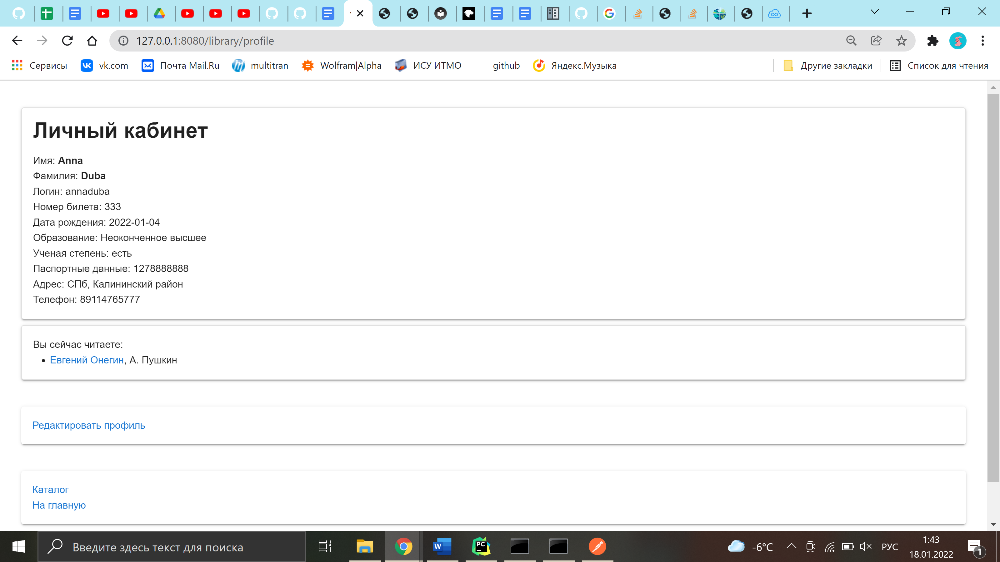

# Reader profile

**URL** : `/profile/`

### Description

The page shows the reader's personal information and the list of books they are currently reading. The book links, if
clicked, transfer the user to the corresponding book info pages. Below there is a link to the profile editing page.  
At the bottom of the page there are links to the library catalogue and home pages.