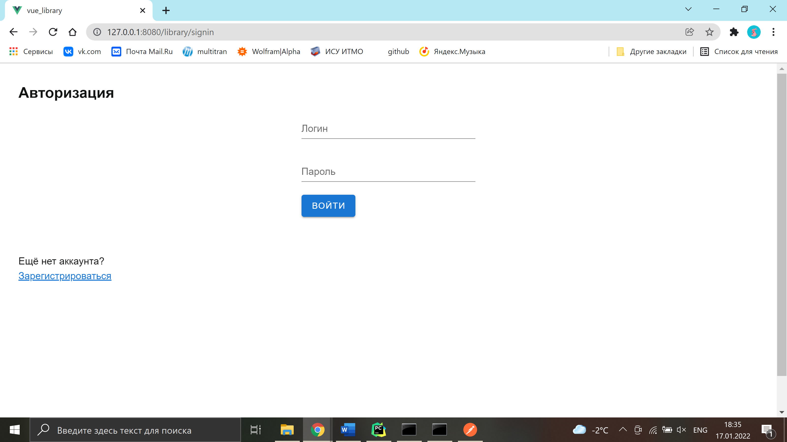

# Sign in

**URL** : `/signin/`

### Description

The page displays a reader sign-in form. The user is supposed to fill in their username and password. After pressing
the _sign in_ button, they are authorized and forwarded to the home page. In case the user does not have a profile yet, they follow the link
at the bottom which transfers them to the sign-up page.