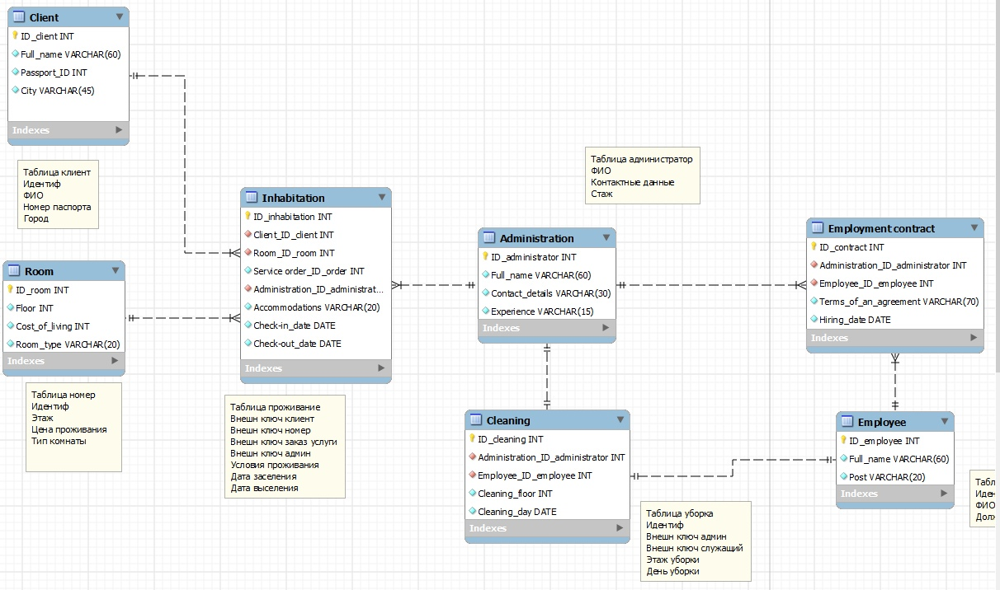

# Администрирование отеля

Количество номеров в гостинице известно, и имеются номера трех типов: одноместный, двухместный и трехместный, отличающиеся стоимостью проживания в сутки. В каждом номере есть телефон. О каждом проживающем должна храниться следующая информация: номер паспорта, фамилия, имя, отчество, город, из которого он прибыл, дата поселения в гостинице, выделенный гостиничный номер. О служащих гостиницы должна быть известна информация следующего содержания: фамилия, имя, отчество, где (этаж) и когда (день недели) он убирает. Служащий гостиницы убирает все номера на одном этаже в определенные дни недели, при этом в разные дни он может убирать разные этажи.

СУБД: PostgreSQL

Версия:. 13.2 