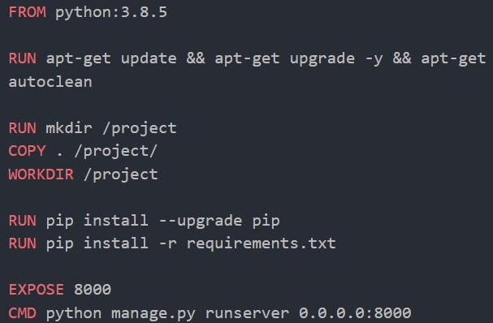
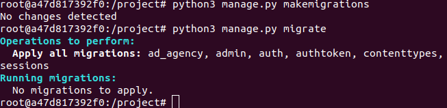

# 1. Контейниризация средствами Docker

## Dockerfile для запуска бэкенд части проекта
Создается рабочая директория, в которую копируются все файлы. Устанавливаются все необходимые библиотеки, описанные в файле requirements.txt, и с помощью команды python manage.py runserver запускается серверная часть.

## Выполнение миграций
С помощью команды docker ps можно узнать id контейнера, чтобы потом с помощью нижепредставленной команды в нем было возможно выполнить миграции.
