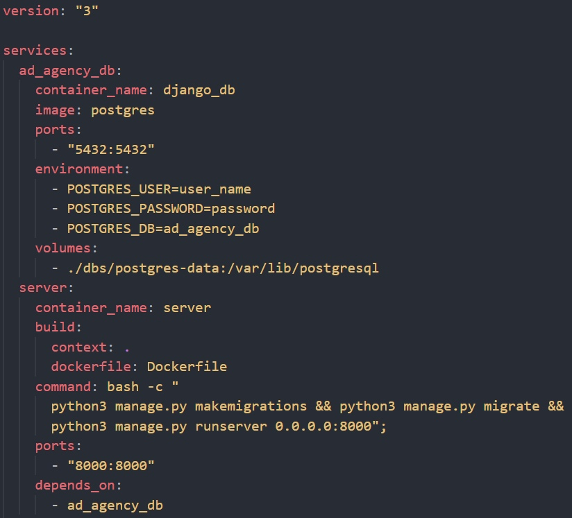
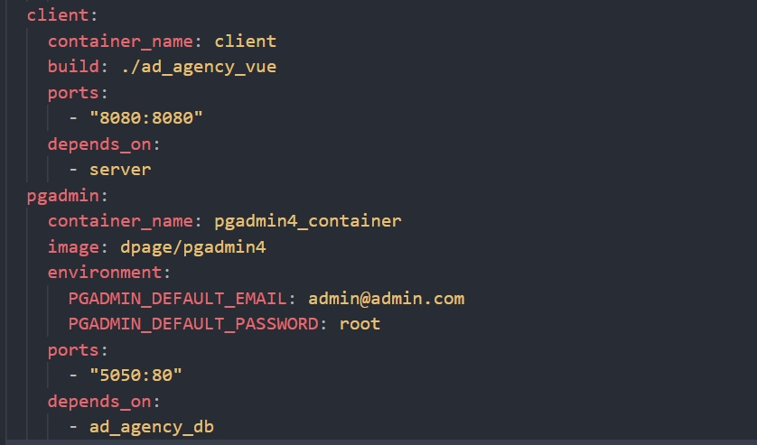
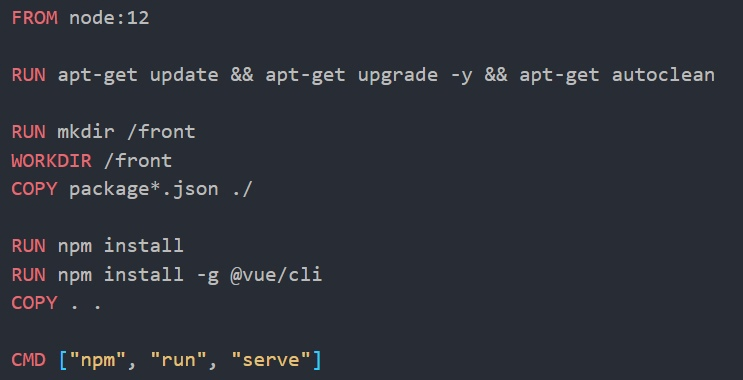
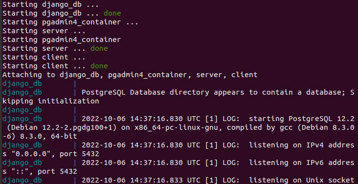
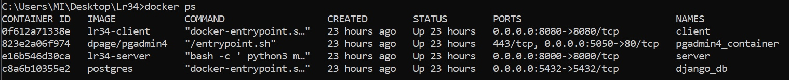
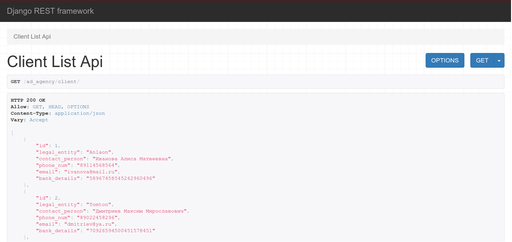
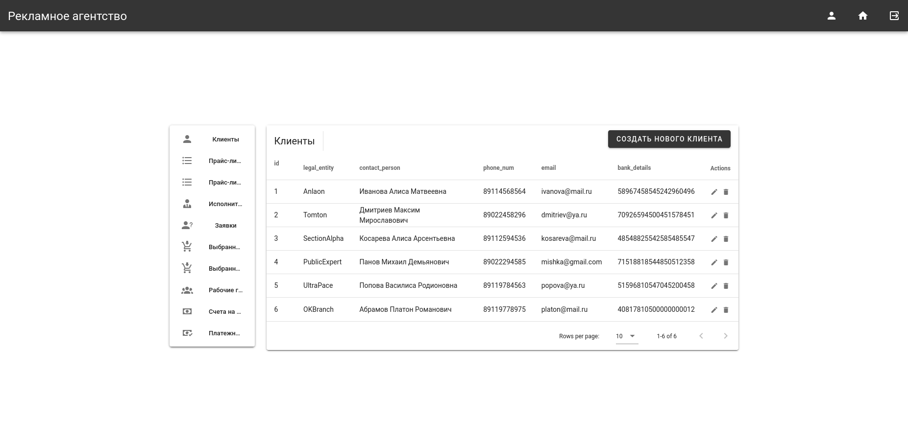
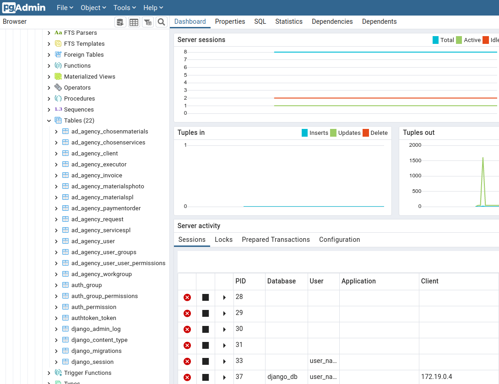

# 2. Оркестрация средствами Docker-compose.

## docker-compose.yml
Для оркестрации создается файл docker-compose.yml, в котором описана работа 4 сервисов.

## Dockerfile для запуска клиентской части проекта
Создается аналогичным докерфайлу для бэкенд части. Дополнительно устанавливается компонент слайдера для навигационной панели.

## Запуск
Запуск производится через терминал с помощью команды docker-compose up.

## Результаты

Серверная часть

Клиентская часть

Добавление нового пользователя через терминал

Подключение созданного пользователя
