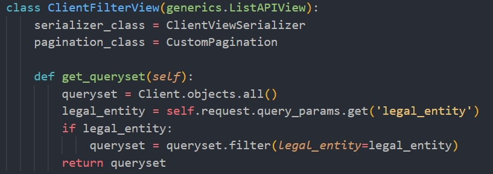
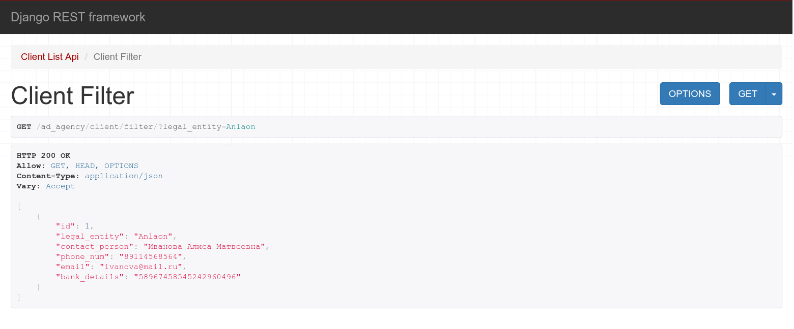
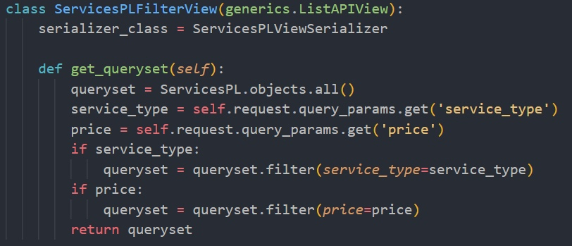
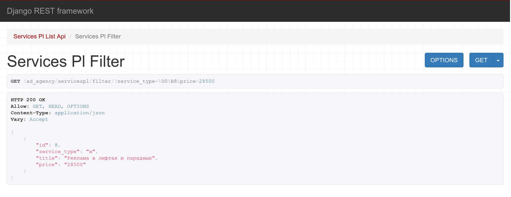
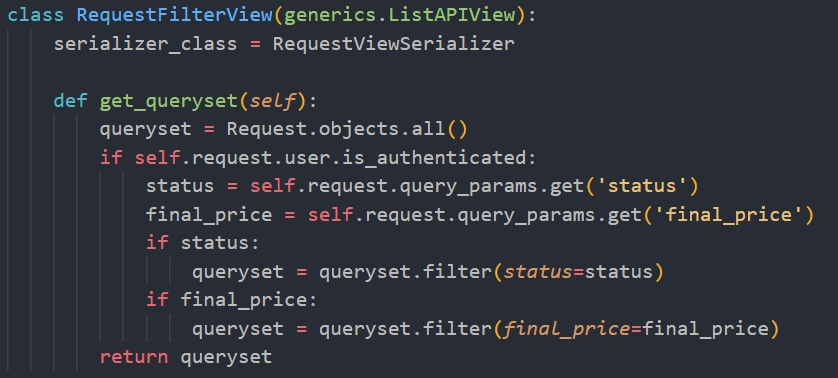
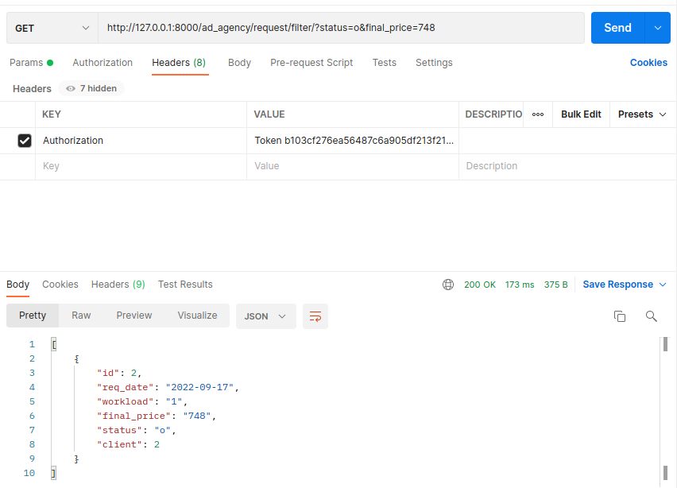

# Ручные фильтры

## Фильтрация клиентов по юридическому лицу
Принимается параметр из url-адреса, выводятся отфильтрованные данные. (GET, ListAPIView)
### views.py

### Результат

## Фильтрация услуг по типу и цене
Принимаются 2 параметра из url-адреса, выводятся отфильтрованные данные. (GET, ListAPIView)
### views.py

### Результат

## Фильтрация по статусу заказа и итоговой цене
Принимаются 2 параметра из url-адреса, если пользователь авторизован, то выводятся отфильтрованные данные, а если нет — 
неотфильтрованные. (GET, ListAPIView)
### views.py

### Результат

