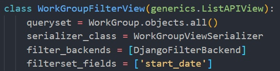
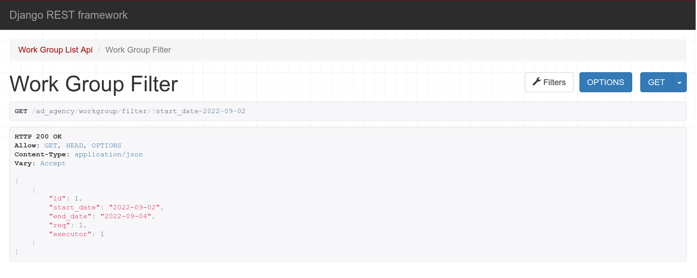
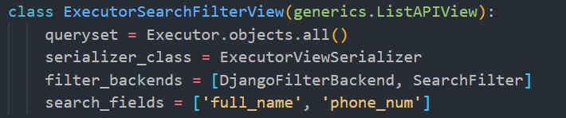
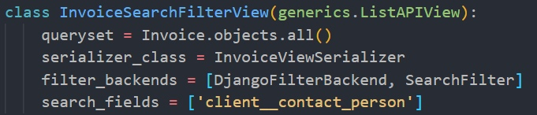
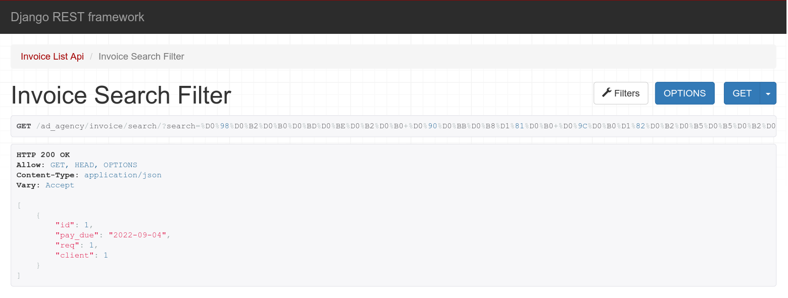
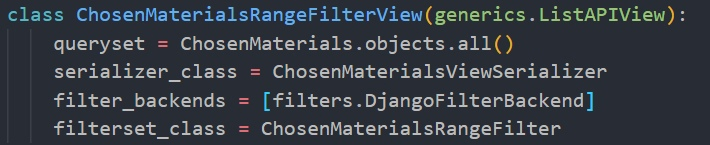
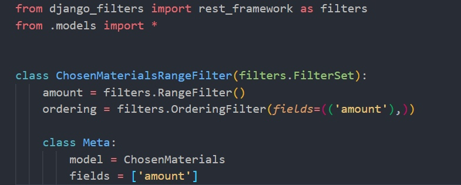
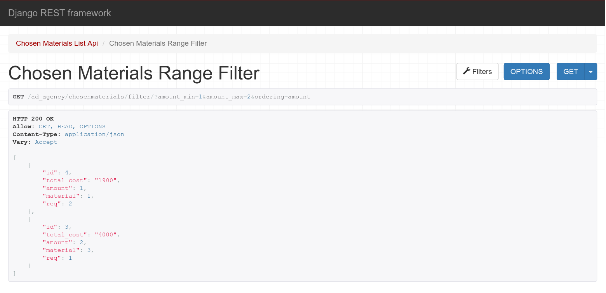

# Автоматические фильтры

## Фильтрация рабочих групп по дате начала работы
### views.py

### Результат

## Поиск исполнителя по имени и номеру телефона
### views.py

### Результат

## Поиск информации о заявке
Поиск по полям из связной таблицы Invoice.
### views.py

### Результат

## Сортировка в диапазоне количества используемых материалов
### views.py

### filters.py

### Результат

