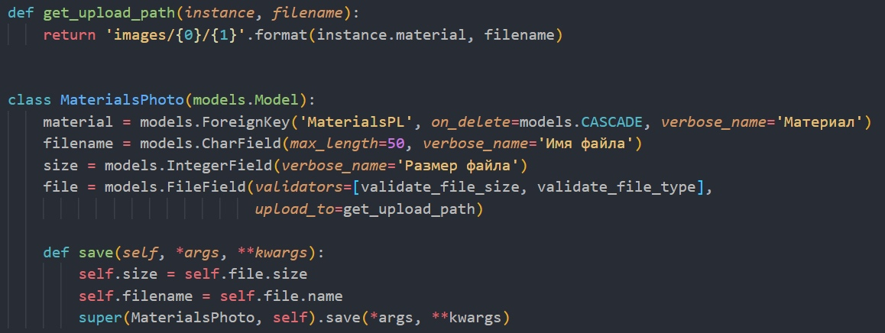
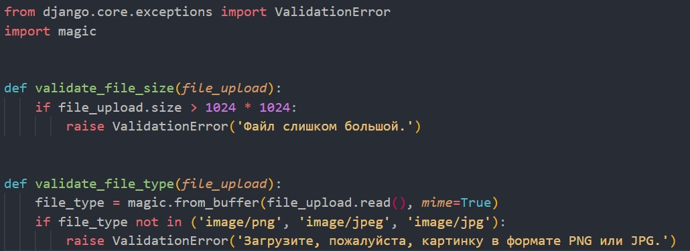
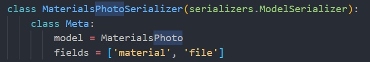
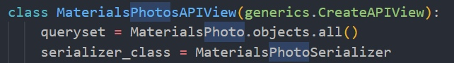
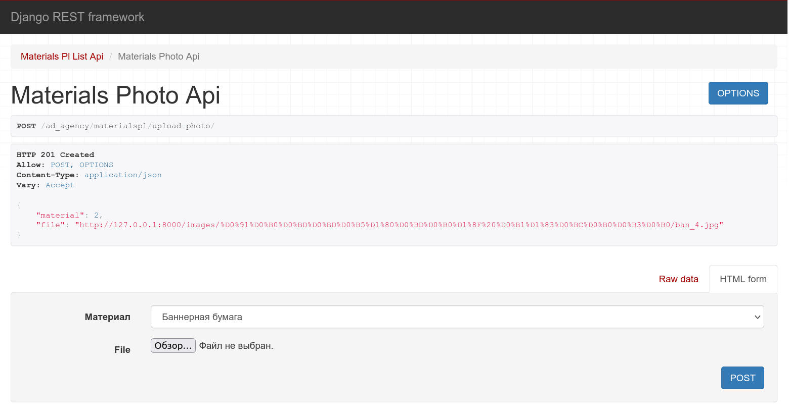
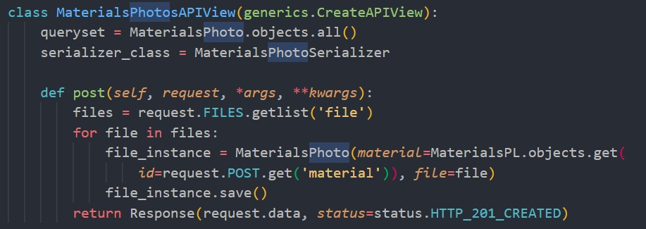
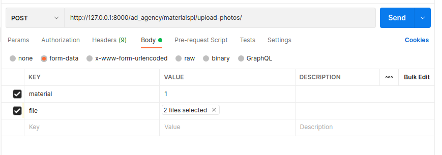

# Загрузка и валидация файлов

## Загрузка одного файла
### models.py

### validators.py

### serializer.py

### views.py

### Результат

## Загрузка нескольких файлов
### views.py

### Результат

