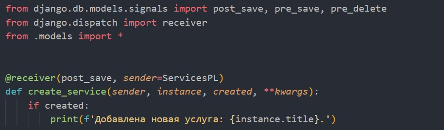
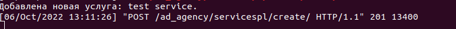
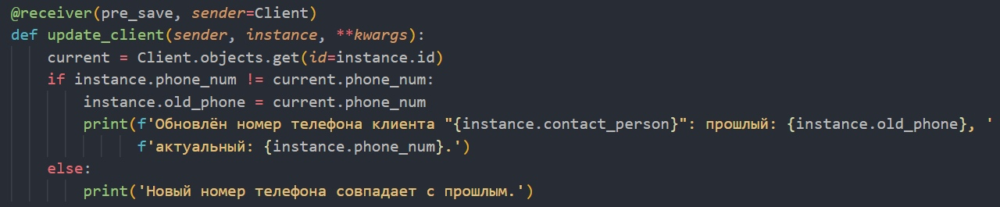
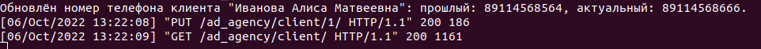
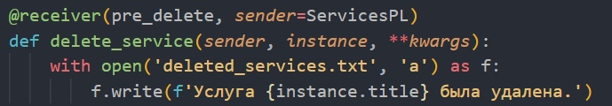
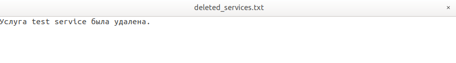

# Cигналы

## 1.
Вызывает логику во время создания экземпляра объекта.
### signals.py

### Результат

## 2.
Сохраняет значения выбранных полей в таблице в 
специальные поля для хранения предыдущих значений 
при обновлении объекта.
### signals.py

### Результат

## 3.
При удалении объекта записывает информацию об удалении в лог.
### signals.py

### Результат

