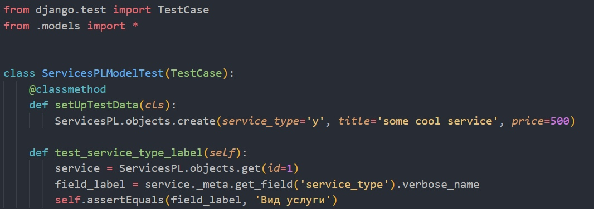
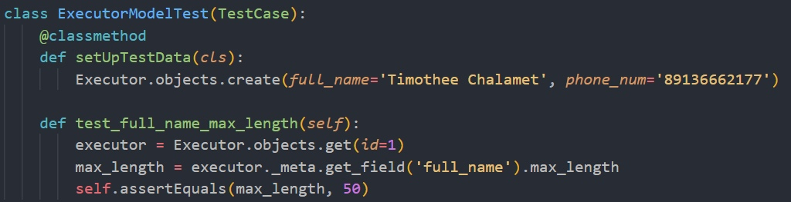
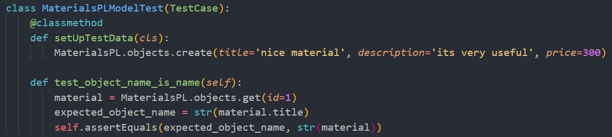

# Тесты на модель
## test_models.py

### Тест названия поля service_type в модели Services

### Тест максимальной длины поля full_name в модели Executor

### Тест названия объекта модели Materials

