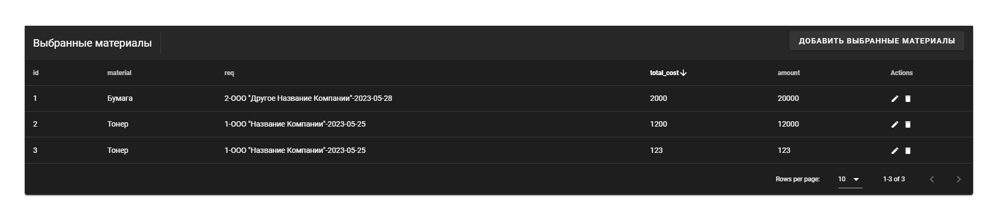
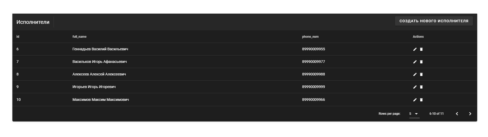
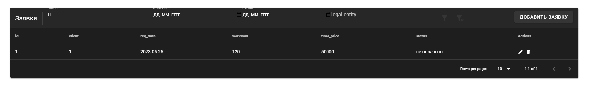
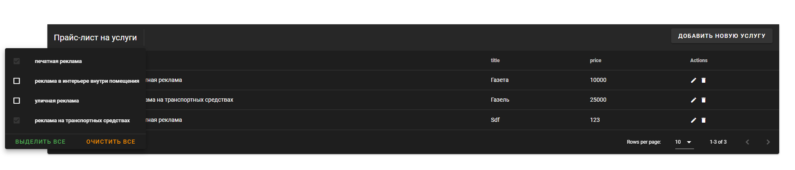
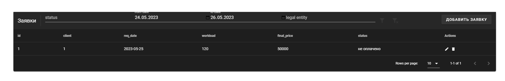

# Описание интерфейсов

## Сортировка списка бронирований

Пример сортировки по количеству использования материалов:

## Пагинация
Позволяет быстро переключаться на необходимую страницу.

Пример пагинации на списке исполнителей:

## Поиск заказов по статусу оплаты
Позволяет найти только те объекты, которые соответствуют введенному значению.

Результат поиска:

## Фильтрация с чекбоксами 
Выводит объекты по всем отмеченным типам.

Результат поиска:

## Фильтрация по диапазону 
Позволяет находить заказы в выбранном диапазоне по дате создания.

Результат поиска:

