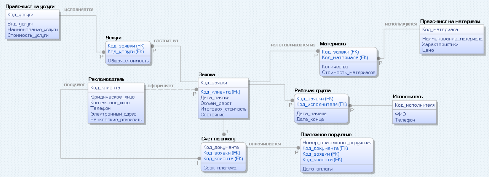

# Лабораторная работа №3: Реализация серверной части на django rest. Документирование API.

---

## Инфологическая модель базы данных:

## Текст задания:
Создать программную систему, предназначенную для отдела маркетинга рекламного агентства.
Одной из задач, решаемых отделом маркетинга рекламного агентства «Луч», является учет работы с клиентами. Для этого
необходимо организовать оперативный учет поступивших и выполненных заявок клиентов (рекламодателей). Рекламное агентство
заключает трудовые соглашения с заказчиками на исполнение определенного вида рекламных услуг. Для оформления заявки
рекламодатель должен указать контактное лицо, телефон и электронный адрес для связи. Рекламодатель оформляет заявку на
рекламу, пользуясь прайс–листом, в котором указаны цены по наименованию рекламных услуг, предоставляемых агентством
«Луч». Здесь же оговариваются исполнители изготовления рекламы (сотрудники агентства), стоимость и объем (количество)
работ. Для выполнения работ необходимо знать единицы измерения и материалы. Заказчик должен иметь контактные данные
исполнителя. Согласно заявке выписывается Платежное Поручение Заказчику, которое он обязан оплатить. После оплаты счета
агентство обязуется предоставить рекламные продукты. Заказ считается выполненным, если оплачено Платежное поручение.

